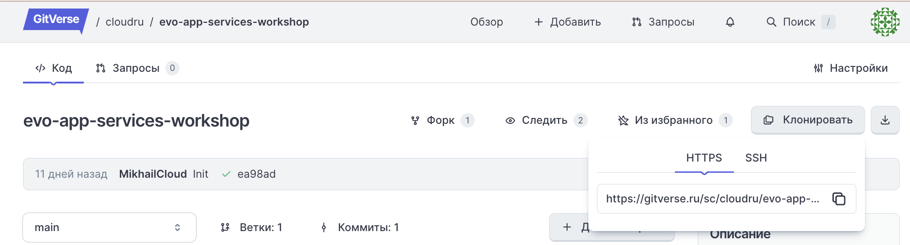
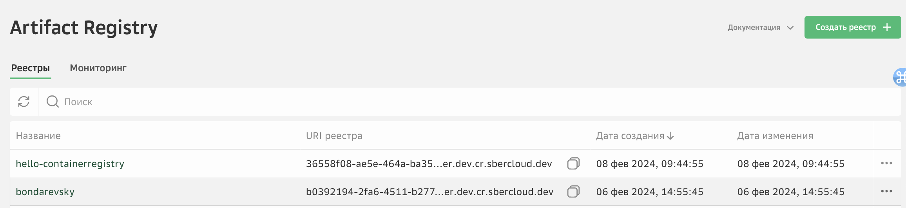
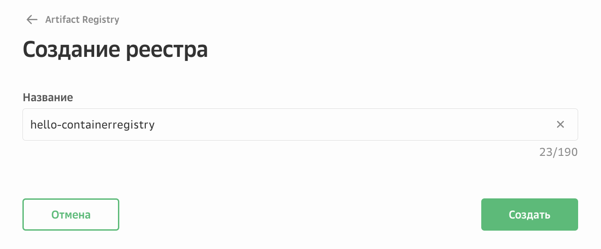

# Lab 1: Развертывание frontend-приложения

В данной лабораторной работе вы получите первый практический опыт использования облачных сервисов для разработчиков Evo Container Apps и Evo Artifact Registry на примере развертывания простого frontend-приложения.


### 1. (Опционально) Клонируйте репозиторий кода c GitVerse

```
git clone https://gitverse.ru/sc/cloudru/evo-containerapp-react-sample.git
``` 

### 2. Создание реестра в Artifact Registry
В личном кабинете https://console.cloud.ru перейдите в сервис Artifact Registry и выберите «Создать реестр».


Укажите название реестра — оно станет частью URI, который вы будете использовать при работе а docker cli. Название реестра должно быть глобально уникальным в сервисе Artifact Registry. 



Скопируйте полученный URI реестра, он будет необходим при выполнении дальнейших шагов. 

### 3. Получение ключей доступа для реестра
В личном кабинете, в профиле пользователя создайте ключ доступа либо создайте сервисную учетную запись. Сохраните пару Key ID (логин) и Key Secret (пароль). 

### 4. Авторизация в реестре Artifact Registry 
Откройте терминал и введите команду для аутентификации. Вы можете использовать любой привычный для вас терминал.

```bash
docker login <URI_реестра> -u <keyid> -p <password>
```
где: 
<URI_реестра> — URI, сгенерированный после создания реестра в Artifact Registry.
<keyid> — логин от сервисного аккаунта (Key ID).
<password> — пароль от сервисного аккаунта (Key Secret).

### 5. Сборка и подготовка docker-образа

Cоберите на локальном компьютере готовый Docker-образ из репозитория GitVerse, выполнив в консоли следующую команду docker cli: 
```shell
docker build --tag <URI_реестра>/react-hello-world https://gitverse.ru/sc/mabondarevskiy/evo-containerapp-react-sample.git#main --platform linux/amd64
```
Данная команда собирает образ и тегирует его в формате готовом для дальнейшей загрузки в реестр.

Для дальнейшего запуска docker-образа в сервисе Container Apps образ должен быть собран под платформу ***linux/amd64***.

### 6. Загрузка docker-образа
Загрузите образ в реестр образов Artifact Registry, выполнив команду.
```bash
docker push <URI_реестра>/react-hello-world
```
где: 
<URI_реестра> — URI, сгенерированный после создания реестра в Artifact Registry.
react-hello-world — имя будущего репозитория в Artifact Registry. 
Имя репозитория должно соответствовать имени Docker-образа. 

Убедитесь, что в Artifact Registry появился репозиторий с указанным именем и загруженный образ.

### 7. Создание и запуск контейнера в сервисе Container Apps.
Откройте меню загруженного образа и нажмите **Создать Container App**. 


Заполните поля и активируйте опции:


**Название контейнера** — глобально уникальное имя на базе которого формируется fqdn адрес вашего приложения в домене *.containers.cloud.ru.

**Порт контейнера** — порт контейнера должен совпадать с портом, который слушает ваше приложение. В данной лабораторной работе используется порт 8080

```
server {
    listen 8080;
    root /usr/share/nginx/html;
    index index.html;

    location / {
        try_files $uri $uri/ /index.html;
    }
}
```

**vCPU/RAM** — количество vCPU и RAM, которые выделяются для каждого экземпляра контейнера при обработке вызова. 

**Минимальное** и **максимальное количество экземпляров** при масштабировании сервиса. По умолчанию происходит масштабирование с 0, что может вызывать небольшую задержку при старте вашего приложения.

**Публичный адрес**— активируйте опцию, чтобы получить URL-адрес для вызова контейнера из сети Интернет.

**Автоматическое развертывание** — если опция активирована, то каждый раз после загрузки в Artifact Registry новой версии образа на стороне Container Apps будет автоматически создаваться новая ревизия контейнера на базе обновленной версии docker-образа. 

Нажмите **Создать**.

Откроется страница сервиса Container Apps. 
Контейнер будет запущен в течение нескольких секунд.

Когда контейнер перейдет в статус **Выполняется**, значит он успешно запущен.


### 8. Проверка рабостоспособности развернутного приложения
Дождитесь появления **Публичного URL**, скопируйте его и вставьте в адресную строку браузера.
!!! warning
    Если приложение не отвечает проверьте в списке ревизий, что последняя ревизия (первая по списку) в статусе Выполняется


    
!!! sucess
    Поздравляем, вы только что развернули приложение в облачном контейнере и опубликовали его в интернет 🙌 

### Заключение
В данной лабораторной работе вы научились:

- загружать docker-образ в Artifact Registry
- создавать и запускать контейнер с помощью сервиса Container Apps

В следующей лабораторной работе вы научитесь развертывать backend-приложения и познакомитесь с дополнительными настройками облачных сервисов Container Apps и Artifact Registry.