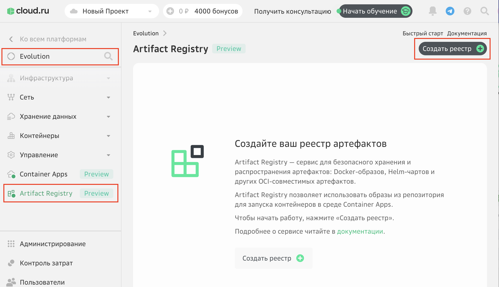
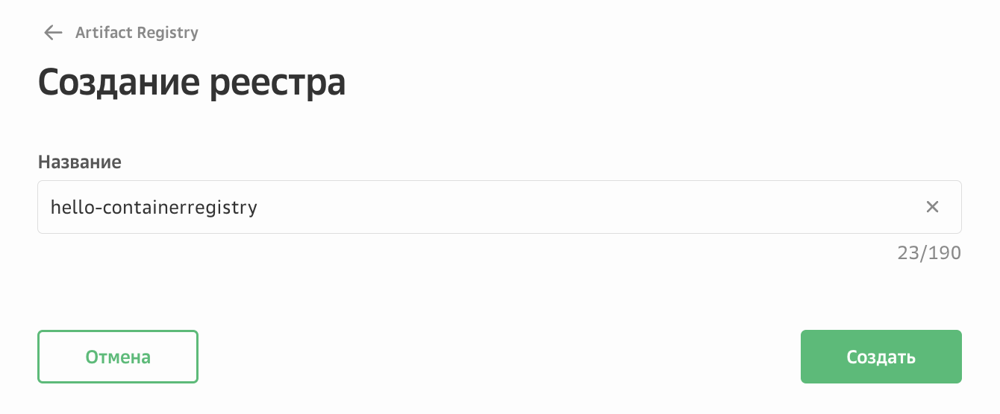
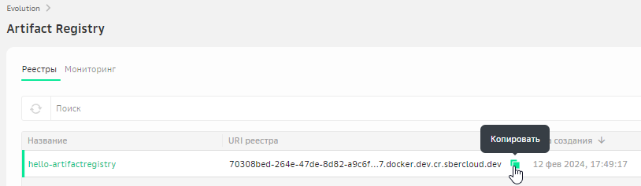
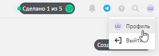
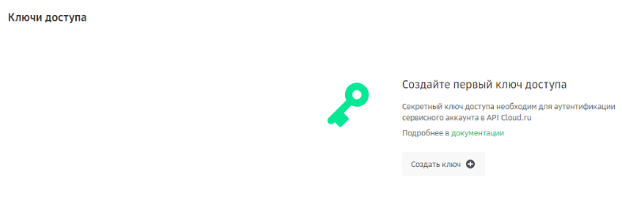
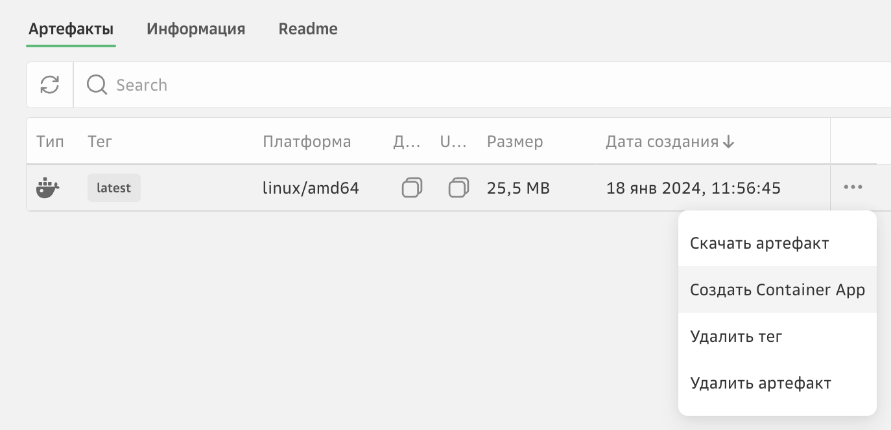
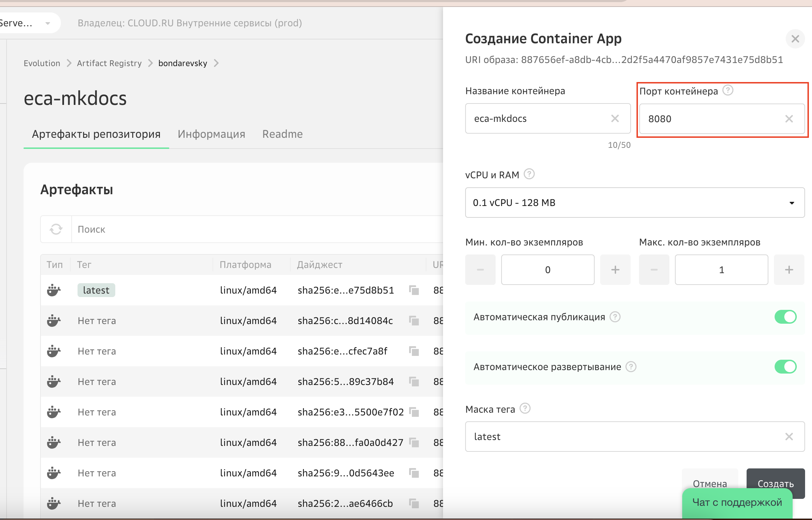
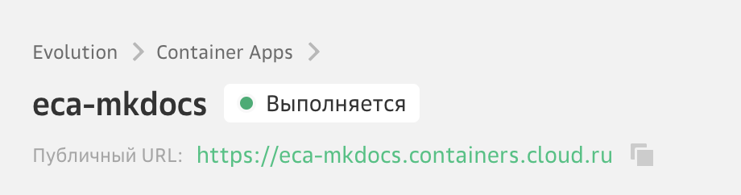
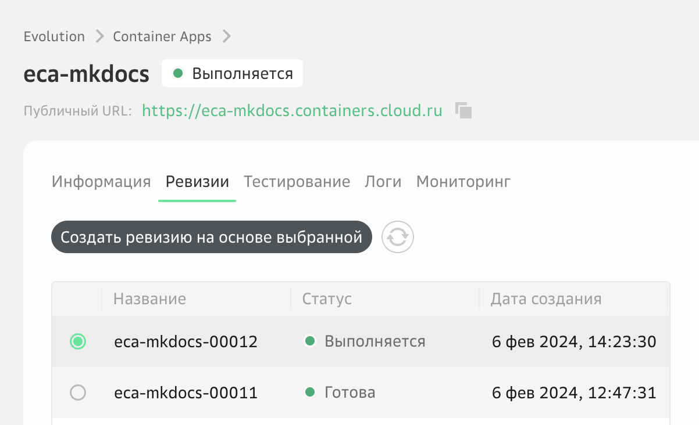

# Lab 1: Развертывание frontend-приложения

В этой лабораторной работе вы получите первый практический опыт использования облачных сервисов для разработчиков Evolution Container Apps и Evolution Artifact Registry на примере развертывания простого frontend-приложения.

Вы загрузите Docker-образ с готовым приложением в реестр, создадите контейнер и опубликуете приложение в интернет. 


### 1. (Опционально) Клонируйте или скачайте репозиторий кода c GitVerse

 

```
git clone https://gitverse.ru/sc/cloudru/evo-containerapp-react-sample.git
```

### 2. Создайте реестр в Artifact Registry
В [личном кабинете](https://console.cloud.ru){target=_blank} перейдите на карточку сервиса Artifact Registry и нажмите «Создать реестр».



Укажите название реестра — оно станет частью URI, который вы будете использовать при работе в Docker CLI. 



Скопируйте полученный URI реестра, он будет нужен для выполнения дальнейших шагов. 



### 3. Получите ключи доступа для аутентификации
В личном кабинете перейдите в раздел «Профиль».



Выберите раздел «Ключи доступа» и нажмите «Создать ключ».



Введите краткое описание ключа, которое поможет в будущем идентифировать его среди других ключей.
Задайте время жизни ключа: от 1 до 365 дней. 
Нажмите «Создать».

После этого будут сгенерированы Key ID (логин) и Key Secret (пароль). 
Сохраните Key Secret. После того как вы закроете окно, повторно посмотреть его будет нельзя. 

### 4. Авторизация в реестре Artifact Registry 
Откройте терминал и введите команду для аутентификации. Вы можете использовать любой привычный для вас терминал.

```bash
docker login <URI_реестра> -u <keyid> -p <password>
```
где: 
- <URI_реестра> — URI, сгенерированный после создания реестра в Artifact Registry.
- <keyid> — логин от сервисного аккаунта (Key ID).
- <password> — пароль от сервисного аккаунта (Key Secret).

### 5. Соберите и подготовьте Docker-образ

Cоберите на локальном компьютере готовый Docker-образ из репозитория GitVerse, выполнив в терминале следующую команду: 

```shell
docker build --tag <URI_реестра>/react-hello-world https://gitverse.ru/sc/cloudru/evo-containerapp-react-sample.git#master --platform linux/amd64
```
Команда собирает образ и тегирует его для дальнейшей загрузки в реестр.
Для создания контейнера Docker-образ должен быть собран под платформу ***linux/amd64***.

### 6. Загрузите Docker-образ в реестр

Загрузите образ в реестр Artifact Registry, выполнив команду:

```bash
docker push <URI_реестра>/react-hello-world
```
где: 
- <URI_реестра> — URI, сгенерированный после создания реестра в Artifact Registry.
- react-hello-world — имя будущего репозитория в Artifact Registry. Имя репозитория должно соответствовать имени Docker-образа. 

Убедитесь, что в Artifact Registry появился репозиторий с указанным именем и загруженный образ.


### 7. Создайте и запустите контейнер

Откройте меню загруженного образа и нажмите **Создать Container App**. 



Заполните поля и активируйте опции:



**Название контейнера** — глобально уникальное имя, на базе которого формируется адрес вашего приложения в домене *.containers.cloud.ru.

**Порт контейнера** — порт контейнера, который должен совпадать с портом вашего приложения. В этой лабораторной работе используем порт 8080.

```
server {
    listen 8080;
    root /usr/share/nginx/html;
    index index.html;

    location / {
        try_files $uri $uri/ /index.html;
    }
}
```

**vCPU/RAM** — количество vCPU и RAM, которые выделяются для каждого экземпляра контейнера при обработке вызова. Выберите конфигурацию ???

**Минимальное** и **максимальное количество экземпляров** при масштабировании сервиса. По умолчанию происходит масштабирование с 0, что может вызывать небольшую задержку при старте вашего приложения. Выберите конфигурацию ???

**Публичный адрес**— активируйте опцию, чтобы получить URL-адрес для вызова контейнера из сети Интернет.

**Автоматическое развертывание** — если опция активирована, то каждый раз после загрузки в Artifact Registry новой версии образа на стороне Container Apps будет автоматически создаваться новая ревизия контейнера на базе обновленной версии Docker-образа. 

Нажмите **Создать**.

Откроется страница сервиса Container Apps. 
Контейнер будет запущен в течение нескольких секунд.

Когда контейнер перейдет в статус **Выполняется**, значит он успешно запущен.




### 8. Проверьте рабостоспособность развернутного приложения

Дождитесь появления **Публичного URL**, скопируйте его и вставьте в адресную строку браузера.

Если приложение не отвечает проверьте в списке ревизий, что последняя ревизия (первая по списку) в статусе **Выполняется**.


    
:thumbsup: Поздравляем, вы только что развернули frontend-приложение в облачном контейнере и опубликовали его в Интернет!  

### Что дальше

В данной лабораторной работе вы научились:

- загружать Docker-образ в Artifact Registry;
- создавать и запускать контейнер с помощью сервиса Container Apps.

В следующей лабораторной работе вы научитесь разворачивать backend-приложение и познакомитесь с дополнительными настройками облачных сервисов Container Apps и Artifact Registry.