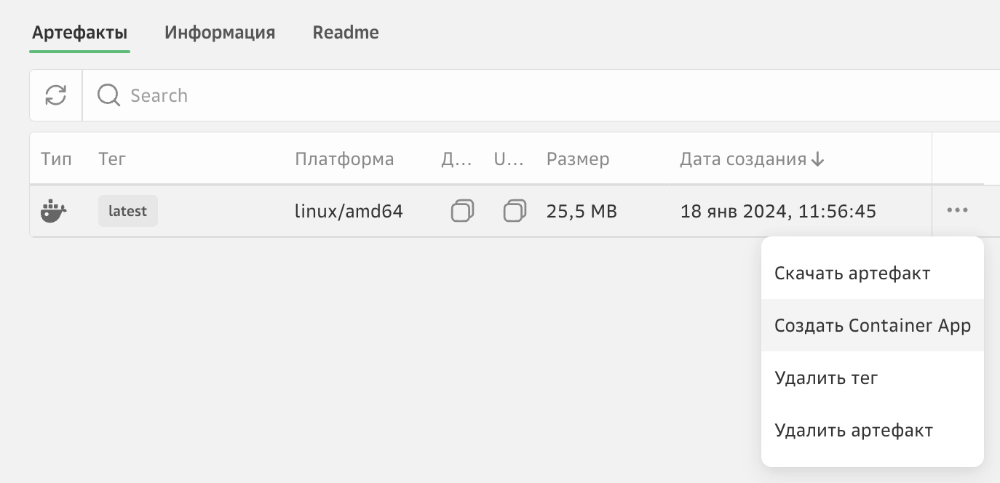
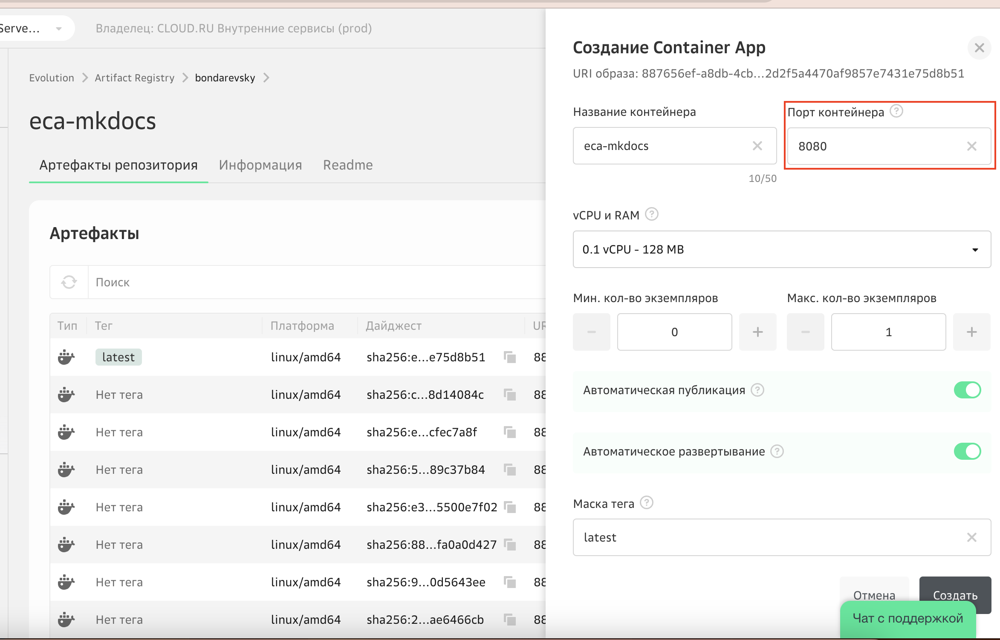
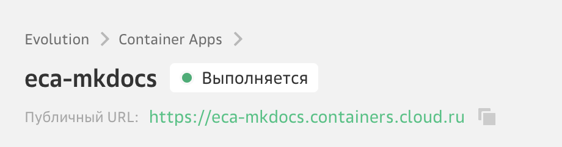
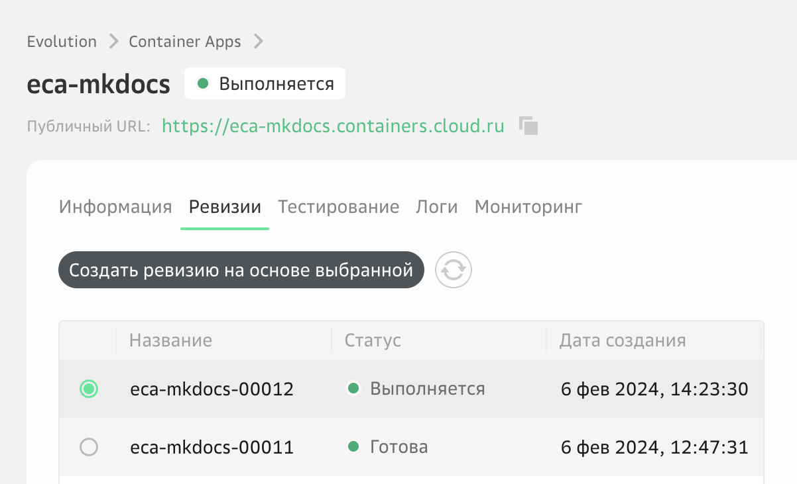

# Развертывание frontend-приложения на React

В данной лабораторной работе вы будете использовать репозиторий GitVerse с исходным кодом готового приложения, соберете docker-образ, загрузите его в приватный репозиторий Artifact Registry и развернете контейнер в облачной среде Container Apps.

1. (Опционально) Клонируйте репозиторий кода c GitVerse
```
git clone https://gitverse.ru/sc/mabondarevskiy/evo-app-services-workshop.git
``` 

2. В личном кабинете Cloud.ru перейдите в сервис Artifact Registry.

<скриншот>


3. Нажмите «Создать реестр».

<скриншот>


Укажите название реестра — оно станет частью URI, который вы будете использовать для аутентификации в Artifact Registry. Название реестра должно быть глобально уникальным в сервисе Artifact Registry. 

<скриншот>


Скопируйте полученный URI.

<скриншот>


4. Откройте терминал и введите команду для аутентификации. Вы можете использовать любой привычный для вас терминал .

```bash
docker login <URI_реестра> -u <keyid> -p <password>
```
где: 
<URI_реестра> — URI, сгенерированный после создания реестра в Artifact Registry.
<keyid> — логин от сервисного аккаунта (Key ID).
<password> — пароль от сервисного аккаунта (Key Secret).


5. Cоберите на локальном компьютере готовый Docker-образ из репозитория GitVerse, выполнив в консоли следующую команду docker cli: 

```shell
docker build --tag <Название_реестра>.cr.cloud.ru/react-hello-world https://gitverse.ru/sc/mabondarevskiy/evo-app-services-workshop.git#main --platform linux/amd64
```

6. Загрузите образ в реестр образов Artifact Registry, выполнив команду.

```bash
docker push <URI_реестра>/<repository_name>
```

где: 
<URI_реестра> — URI, сгенерированный после создания реестра в Artifact Registry.
<repository_name> — имя будущего репозитория в Artifact Registry. 
Имя репозитория должно соответствовать имени Docker-образа. Если на предыдущем шаге вы скачивали готовый образ Cloud.ru, то в качестве имени репозитория укажите react-hello-world.


Убедитесь, что в Artifact Registry появился репозиторий с указанным именем и загруженный образ. 

<скриншот>


7. Откройте меню загруженного образа и нажмите **Создать Container App**. 




Заполните поля и активируйте опции:


Название контейнера — произвольное название контейнера, может совпадать с именем образа — например, react-hello-world.


Порт контейнера — порт, на котором будет работать контейнер.
Принимаются значения от 1 до 65535 включительно.


vCPU/RAM — количество vCPU и RAM, которые выделяются для каждого экземпляра контейнера при обработке вызова. Выберите минимальную конфигурацию.


Минимальное и максимальное количество экземпляров при масштабировании сервиса. Укажите 1 и 1. 


Опция «Публичный адрес» — активируйте опцию, чтобы получить URL-адрес для вызова контейнера из интернета по HTTPS.


Опция «Автоматическое развертывание» — если опция активирована, то каждый раз после загрузки в Artifact Registry новой версии образа на стороне Container Apps будет автоматически создаваться новая ревизия контейнера на базе обновленной версии образа. В этом сценарии ее активировать не обязательно. 


Нажмите **Создать**.



Откроется страница сервиса Container Apps. 
Контейнер будет запущен в течение нескольких минут.

Когда контейнер перейдет в статус **Выполняется**, значит он успешно запущен.




8. Дождитесь появления **Публичного URL**, скопируйте его и вставьте в адресную строку браузера. 


!!! warning
    Если приложение не отвечает проверьте в списке ревизий, что последняя ревизия (первая по списку) в статусе Выполняется


    
!!! sucess
    Поздравляем, вы только что развернули приложение в облачном контейнере и опубликовали его в интернет 🙌 
