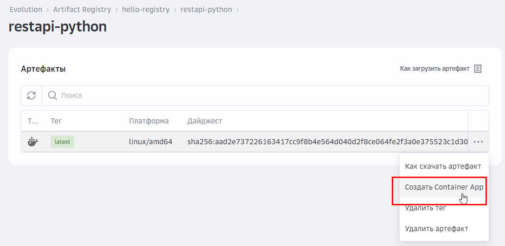
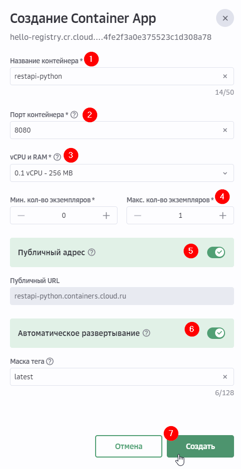
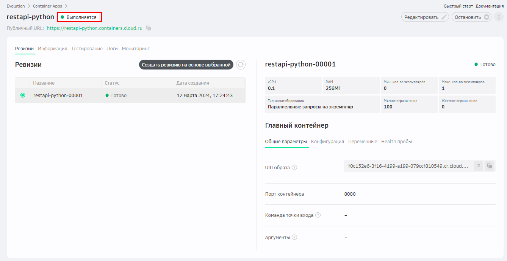
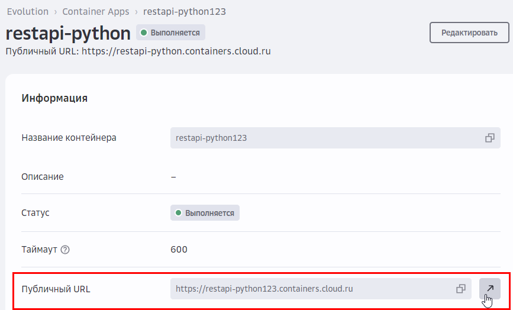

# Lab 2: Развертывание backend-приложения

В этой лабораторной работе вы будете использовать репозиторий GitVerse с исходным кодом готовых backend-приложений на языках Python, Go, Java Script, C#. Каждое приложение является простым примером реализации REST API, которое возвращает список значений с демонстрационными данными. 

На примере развертывания backend-приложения вы познакомитесь с дополнительными настройками сервиса Container Apps.

### 1. Подготовка среды

[Подготовьте среду](/prerequisites), если пропустили этот шаг в начале. 

### 2. (Опционально) Клонируйте или скачайте репозиторий кода c GitVerse

Вы можете зарегистрироваться в [GitVerse](https://gitverse.ru/auth/realms/GitVerse/protocol/openid-connect/auth){target=_blank}, если у вас еще нет аккаунта, и познакомиться с новой системой контроля версий. Этот шаг необязательный и не влияет на дальнейшее прохождение лабораторной работы. 

В данном репозитории находится исходный код простого REST API приложения, написанного на разных языках: Java Script, Python, Go, C#.

```
git clone https://gitverse.ru/sc/cloudru/evo-containerapp-restapi-js-go-python-dotnet-sample.git 
``` 

### 3. Соберите образ и присвойте тег 
Используйте реестр, созданный в [предыдущей лабораторной работе](/lab1), выполнив следующие команды:

```shell
docker build --tag <registry_name>.cr.cloud.ru/restapi-python https://gitverse.ru/sc/cloudru/evo-containerapp-restapi-js-go-python-dotnet-sample.git#master:restapi-python/src --platform linux/amd64
```

### 4. Загрузите Docker-образ в реестр

Загрузите образ в реестр Artifact Registry, выполнив команду:

```bash
docker push <registry_name>.cr.cloud.ru/restapi-python
```

### 5. Создайте и запустите контейнер

Откройте меню загруженного образа и нажмите **Создать Container App**. 



Заполните поля и активируйте опции:



**Название контейнера** — глобально уникальное имя, на базе которого формируется адрес вашего приложения в домене *.containers.cloud.ru.

**Порт контейнера** — порт контейнера, который должен совпадать с портом вашего приложения. В этой лабораторной работе используем порт 8080.

**vCPU/RAM** — количество vCPU и RAM, которые выделяются для каждого экземпляра контейнера при обработке вызова. Выберите минимальную конфигурацию.

**Минимальное** и **максимальное количество экземпляров** при масштабировании сервиса. По умолчанию происходит масштабирование с 0, что может вызывать небольшую задержку при старте вашего приложения. Установите минимальное количество экземпляров в значение 0, а максимальное — 1.

**Публичный адрес**— активируйте опцию, чтобы получить URL-адрес для вызова контейнера из интернета.

**Автоматическое развертывание** — активируйте опцию, чтобы  каждый раз после загрузки в Artifact Registry новой версии образа на стороне Container Apps автоматически создавалась новая ревизия контейнера на базе обновленной версии Docker-образа. 

Нажмите **Создать**.

Откроется страница сервиса Container Apps. 
Контейнер будет запущен в течение нескольких секунд.

Когда контейнер перейдет в статус **Выполняется**, значит он успешно запущен.



### 6. Проверьте рабостоспособность развернутного приложения

Дождитесь появления **Публичного URL**, скопируйте его и вставьте в адресную строку браузера.



Если приложение не отвечает, перейдите в список ревизий и убедитесь, что последняя созданная ревизия (идет первой в списке) находится в статусе **Выполняется**.
    
👍 Поздравляем, вы только что развернули REST API — приложение в облачном контейнере и опубликовали его в интернет!  

### Заключение
В данной лабораторной работе вы научились:

- создавать репозитории в существующих реестрах Artifact Registry;
- создавать и запускать контейнер в Container Apps;
- управлять настройками масштабирования. 

В следующей лабораторной работе вы научитесь развертывать fullstack-приложения.