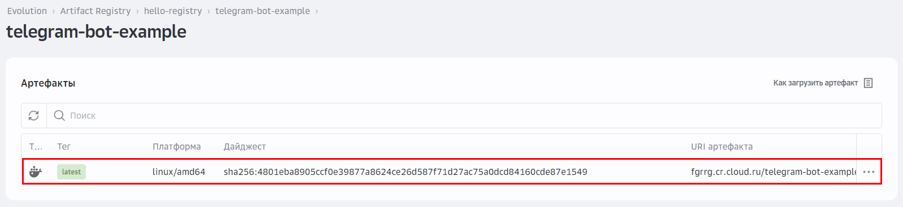
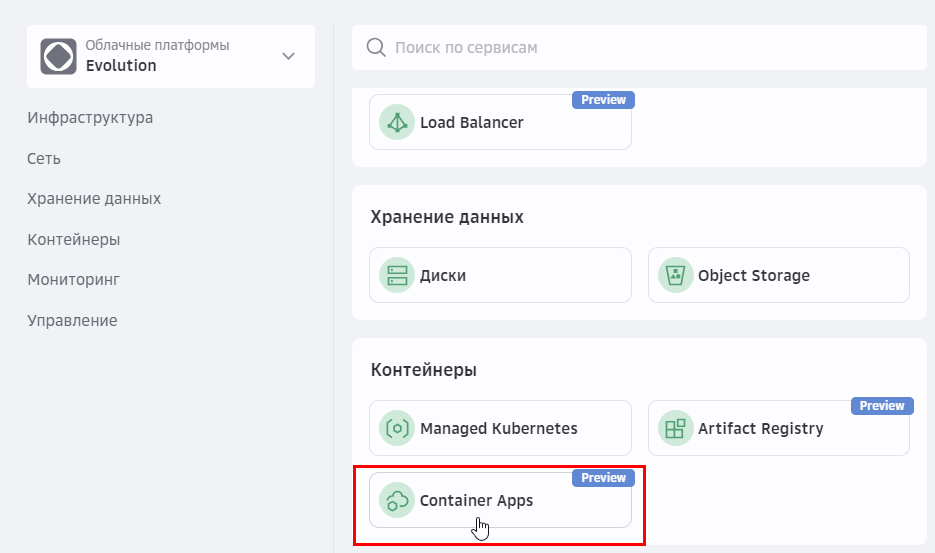
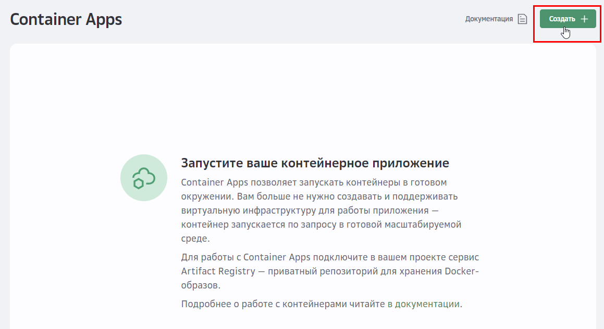
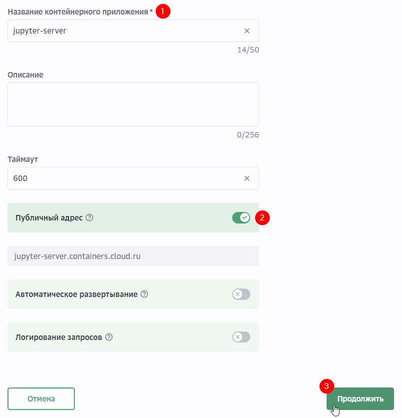
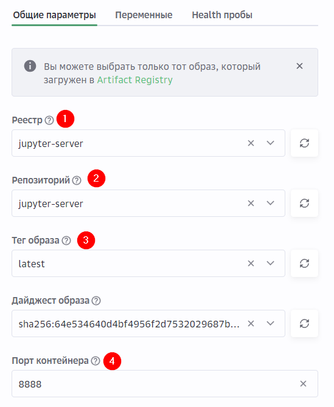
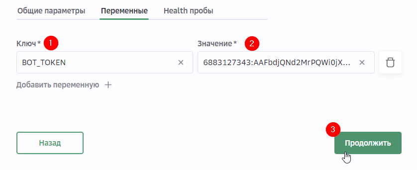
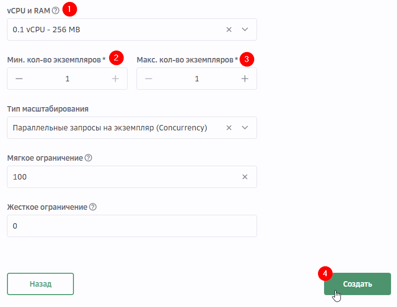
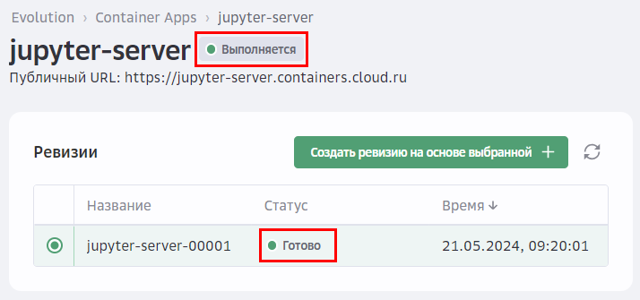
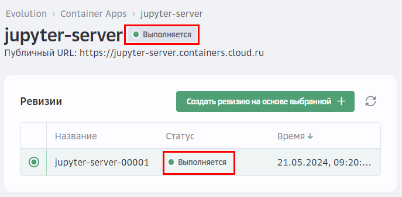
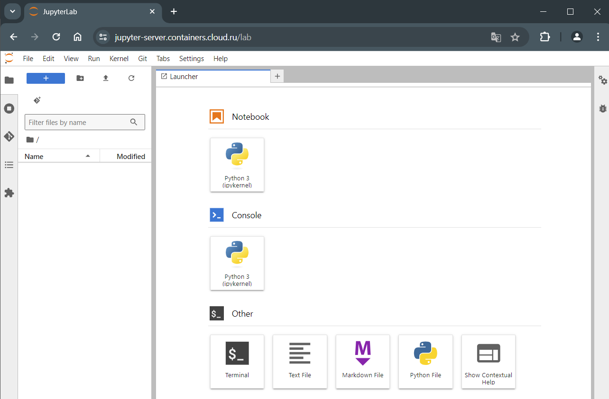

# Lab 3: Развертывание Jupyter Server

В этой лабораторной работе вы будете использовать репозиторий GitVerse с готовым образом Jupyter Server. На примере развертывания Jupyter Server вы познакомитесь с созданием контейнера через интерфейс сервиса Container Apps и дополнительными настройками контейнера.

> Для работы с базовыми образами из РФ используйте [зеркало Docker Hub](https://gitverse.ru/docs/packages/gitverse-registry/){target=_blank}. 
{.is-warning} 

### 1. Подготовьте среду

[Подготовьте среду](/prerequisites), если пропустили этот шаг в начале. 

### 2. Клонируйте репозиторий кода c GitVerse
 
Чтобы использовать образ Jupyter Server, склонируйте репозиторий:

```bash
git clone https://gitverse.ru/sc/cloudru/evo-containerapp-jupyter-server-sample.git
```

### 3. Соберите образ, присвойте тег и загрузите образ

[В первой лабораторной работе](/lab1) для загрузки образа вы создавали реестр в сервисе Artifact Registry, а также получали ключи доступа. Вы можете использовать текущий реестр и ключи доступа или создать новые. Если хотите создать новые, пройдите шаги 3-5 из первой лабораторной работы.  

Соберите образ:

```bash
docker build --platform linux/amd64 -t jupyter-server -f dist/jupyter-server/Dockerfile .
```

Присвойте образу тег:

```bash
docker tag jupyter-server <registry_name>.cr.cloud.ru/jupyter-server
```

Загрузите образ в реестр: 

```bash
docker push <registry_name>.cr.cloud.ru/jupyter-server
```
где: 

- `<registry_name>` — название реестра, которое вы указывали при его создании в Artifact Registry.
- `jupyter-server` — название будущего репозитория в Artifact Registry. Название репозитория соответствует имени Docker-образа.

В личном кабинете перейдите в репозиторий Artifact Registry и убедитесь, что образ загружен.



### 4. Создайте и запустите контейнер

Перейдите в сервис Container Apps через меню в левом верхнем углу экрана.



Нажмите **Создать**.



Укажите название контейнера и активируйте опцию **Публичный адрес**. 

Нажмите **Продолжить**.



Выберите реестр, репозиторий и тег Docker-образа, который вы загрузили в Artifact Registry.

Укажите порт контейнера — 8888.



(Опционально) На вкладке **Переменные** укажите в значение переменной GIT_CLONE_REPO адрес вашего репозитория, если хотите после запуска Jupyter Server сразу работать с исходным кодом.



Нажмите **Продолжить**.

Задайте количество ресурсов:

- vCPU и RAM: 0.1 — 256 MB
- Минимальное количество экземпляров: 1
- Максимальное количество экземпляров: 1

Нажмите **Создать**.



Дождитесь, когда контейнер и ревизия перейдут в статус **Выполняется**.



### 5. Проверьте работу Jupyter Server

Дождитесь появления **Публичного URL**, скопируйте его и вставьте в адресную строку браузера.

Если приложение не отвечает проверьте в списке ревизий, что последняя ревизия (первая по списку) в статусе **Выполняется**.



Откроется интерфейс Jupyter Server.



👍 Поздравляем, вы только что развернули Jupyter Server облачном контейнере! 