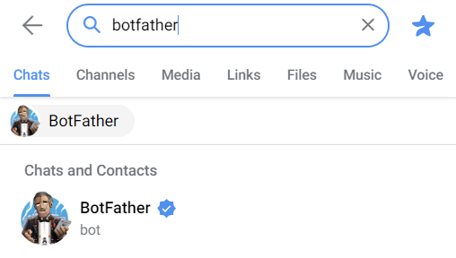
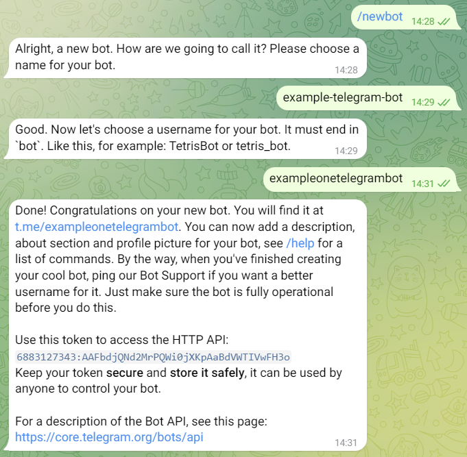
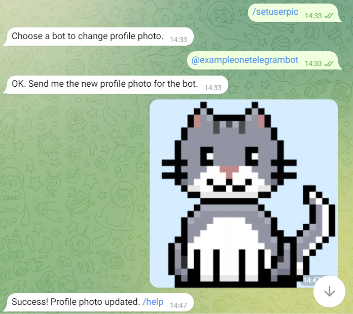
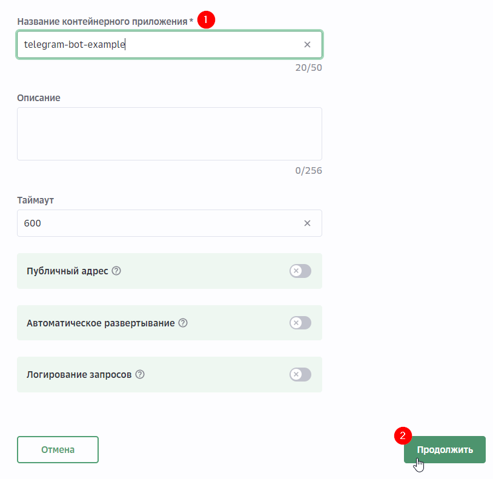
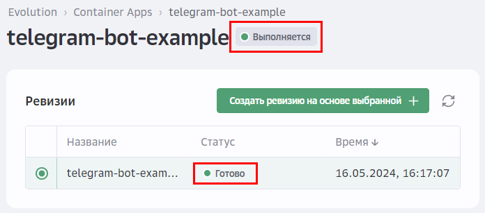
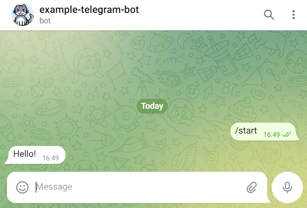

# Lab 3: Развертывание Telegram-бота на Python

В этой лабораторной работе вы будете использовать репозиторий GitVerse с готовым образом Telegram-бота на языке Python. На примере развертывания Telegram-бота вы познакомитесь с созданием контейнера через интерфейс сервиса Container Apps и дополнительными настройками контейнера.

### 1. Подготовка среды

[Подготовьте среду](/prerequisites), если пропустили этот шаг в начале. 

### 3. (Опционально) Клонируйте или скачайте репозиторий кода c GitVerse

Вы можете зарегистрироваться в [GitVerse](https://gitverse.ru/){target=_blank}, если у вас еще нет аккаунта, и познакомиться с новой системой контроля версий. Этот шаг необязательный и не влияет на дальнейшее прохождение лабораторной работы. 

В данном репозитории находится готовый образ Telegram-бота на языке Python.

```
git clone https://gitverse.ru/sc/cloudru/evo-containerapp-telegrambot-python-sample.git
``` 

### 3. Зарегистрируйте Telegram-бота

Зарегистрируйте бота с помощью [BotFather](https://t.me/BotFather){target=_blank}.

В Telegram найдите BotFather.



Выполните команду `/newbot`.

Задайте имя (name) и имя пользователя (username) для бота.
Имя пользователя должно оканчиваться на `...Bot` или `..._bot`.

В нашем случае: 

- name: example-telegram-bot
- username: exampleonetelegrambot

В результате вы получите токен, сохраните его, он потребуется на следующих этапах.



С помощью команды `/setuserpic` установите иконку для вашего бота.



### 4. Соберите образ и присвойте тег

[В первой лабораторной работе](/lab1) вы создавали реестр в сервисе Artifact Registry для загрузки образа.
Вы можете использовать текущий реестр или создать новый. Если вы хотите создать новый реестр, пройдите шаги 3-5 из первой лабораторной работы.  

Соберите образ и присвойте ему тег, выполнив следующую команду:

```
docker build --tag <registry_name>/telegram-bot-example https://gitverse.ru/sc/cloudru/evo-containerapp-telegrambot-python-sample.git#master --platform linux/amd64
```
### 5. Загрузите Docker-образ в реестр

Загрузите образ в репозиторий Artifact Registry, выполнив команду:

```
docker push <registry_name>.cr.cloud.ru/telegram-bot-example
```

В личном кабинете перейдите в репозиторий Artifact Registry и убедитесь, что образ загружен.


### 6. Создайте и запустите контейнер

Перейдите в сервис Container Apps через меню в левом верхнем углу экрана.


Нажмите **Создать**.


Укажите название контейнера и нажмите **Продолжить**.



Выберите реестр, репозиторий и тег Docker-образа, который вы загрузили в Artifact Registry.

Укажите порт контейнера — 5000.


Перейдите на вкладку **Переменные** и добавьте переменную окружения `BOT_TOKEN`. В значение переменной укажите токен, полученный при регистрации Telegram-бота.

Нажмите **Продолжить**.


Задайте количество ресурсов:

- vCPU и RAM: 0.1 — 256 MB
- Минимальное количество экземпляров: 1
- Максимальное количество экземпляров: 1

Нажмите **Создать**.


Дождитесь, когда контейнер перейдет в статус **Выполняется**, а ревизия — в статус **Готово**.



### 7. Проверьте работу Telegram-бота

Вызовите бота в Telegram по имени пользователя (username) и проверьте его работу, выполнив команду `/start`.



👍 Поздравляем, вы только что развернули Telegram-бота в контейнере! 

### Что дальше

В этой лабораторной работе вы научились:

- создавать и запускать контейнер через интерфейс сервиса Container Apps;
- задавать переменные контейнера. 

В следующей лабораторной работе вы научитесь разворачивать fullstack-приложение.