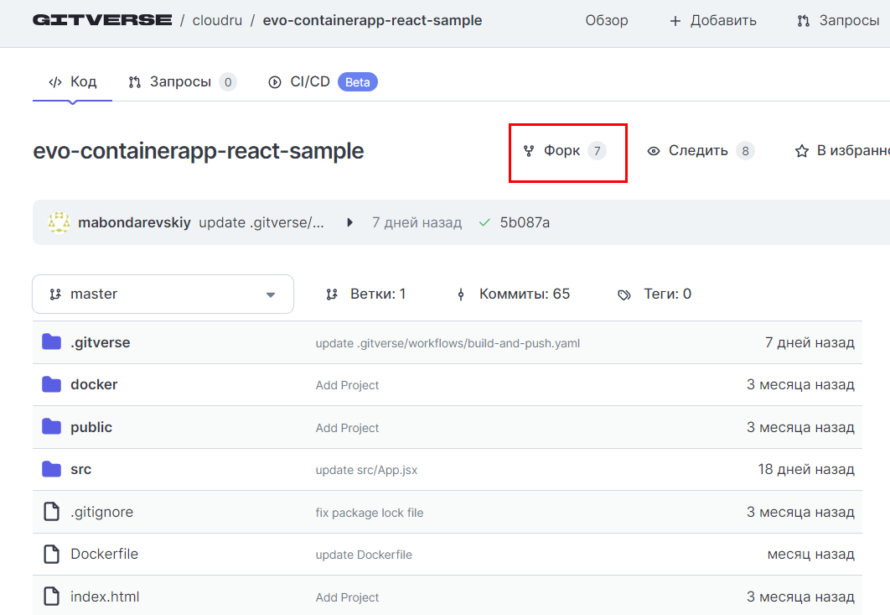
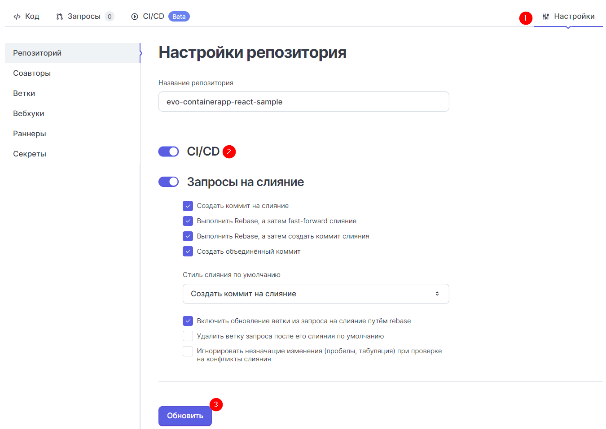
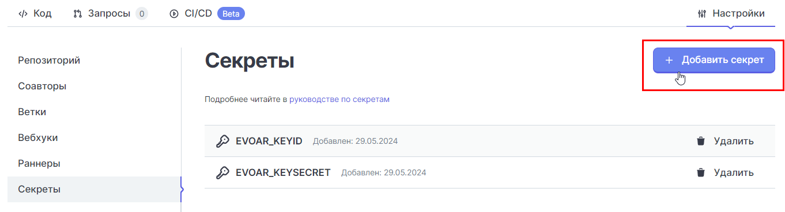
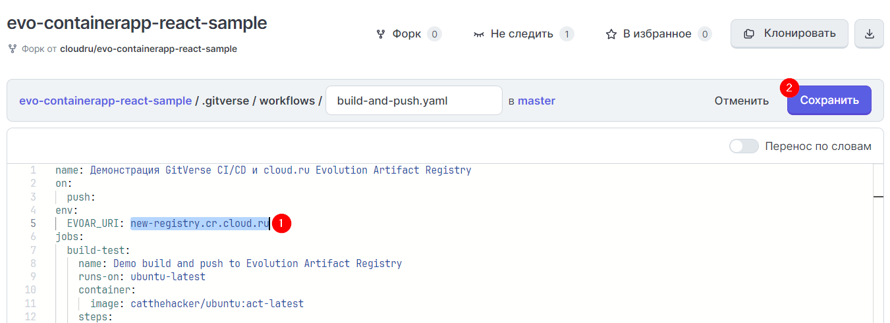
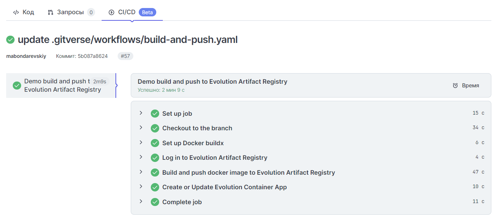

# Lab 4: Настройка пайплайна CI/CD в GitVerse с использованием Artifact Registry

В этой лабораторной работе вы научитесь создавать процесс автоматической сборки и публикации Docker-образа из системы контроля версий GitVerse в Artifact Registry.

### 1. Подготовьте среду

[Подготовьте среду](/prerequisites), если пропустили этот шаг в начале. 

### 2. Создайте реестр в Artifact Registry и получите ключи доступа

[В первой лабораторной работе](/lab1) для загрузки образа вы создавали реестр в сервисе Artifact Registry, а также получали ключи доступа. Вы можете использовать текущий реестр и ключи доступа или создать новые. Если хотите создать новые, пройдите шаги 3-4 из первой лабораторной работы.  

### 3. Форкните репозиторий кода в GitVerse

Создайте учетную запись в [GitVerse](https://gitverse.ru/){target=_blank}, если у вас ее еще нет. 

Перейдите в [репозиторий Cloud.ru с примером кода REST API](https://gitverse.ru/cloudru/evo-containerapp-restapi-js-go-python-dotnet-sample){target=_blank} и нажмите **Форк**.

### 4. Подключите CI/CD и настройте раннер

Перейдите в раздел **Настройки**, активируйте чекбокс **CI/CD** и нажмите **Обновить**.

Установите раннер [по инструкции GitVerse](https://gitverse.ru/docs/actions-conf/runners-uc/){target=_blank}.

### 5. Добавьте переменные и отредактируйте YAML-файл

Перейдите в раздел **Секреты**, добавьте переменные и их значения:

- `EVOAR_KEYID` — логин сервисного аккаунта или персонального ключа (Key ID).
- `EVOAR_KEYSECRET` — пароль сервисного аккаунта или персонального ключа (Key Secret).

В репозитории перейдите в директорию **.github → workflows** и откройте YAML-файл. 

Откройте режим редактирования и в значение переменной EVDAR_URI укажите URI реестра в Artifact Registry.
Нажмите **Сохранить**. 

Коммит запустит пайплайн, каждый шаг которого будет выполняться в порядке, указанном в YAML‑файле.

### 6. Проверьте статус пайплайна

Убедитесь, что все этапы выполнения пайплайна сборки завершились успешно.

👍 Поздравляем, вы только что создавать процесс автоматической сборки и публикации Docker-образа! Теперь при каждом загрузке образа в репозиторий GitVerse обновленный образ будет автоматически отправляться в реестр Artifact Registry.