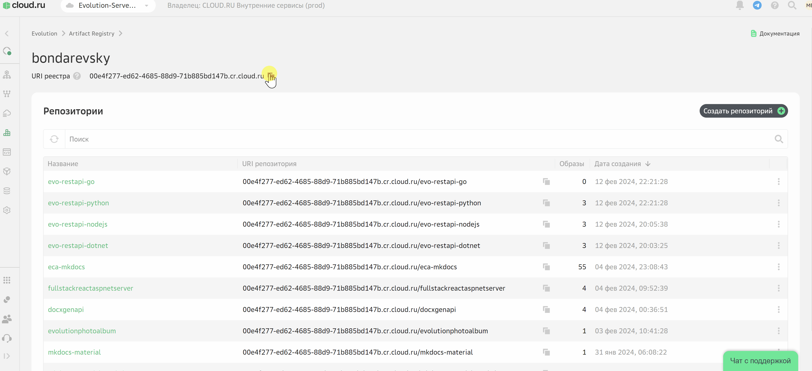

# Lab 4: Развертывание fullstack-приложения


### 1. (Опционально) Клонируйте репозиторий кода c GitVerse

```
git clone https://gitverse.ru/sc/mabondarevskiy/evo-app-services-workshop.git
``` 




### Заключение
В данной лабораторной работе вы научились:

- использовать встроенный сервисы логгирования и мониторинга
- добавлять и использовать переменные окружения
- определять пользовательские health-пробы 