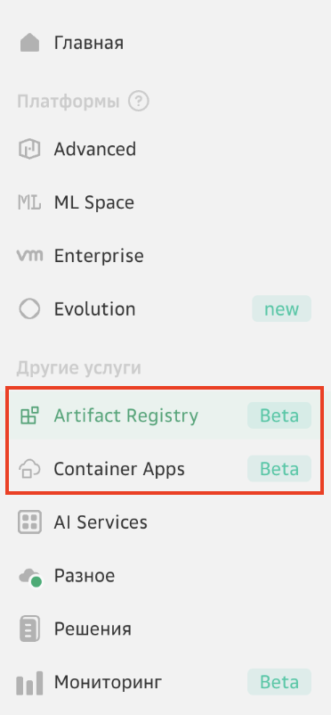

# Необходимые требования, подготовка среды

Перед началом работы необходимо авторизоваться в личном кабинете Cloud.ru и активировать продукты **Container Apps**, **Artifact Registry**.

1. Создайте учетную запись в https://console.cloud.ru, если ее пока нет. После регистрации вы получите доступ к личному кабинету.

2. Активируйте два продукта: **Artifact Registry**, **Container Apps**

3. Установите Docker Desktop -  [Инструкция](https://docs.docker.com/desktop/install/){target=_blank}
4. Установите Git CLI - [Инструкция](https://git-scm.com){target=_blank}