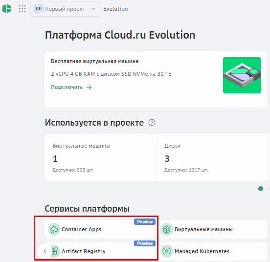

# Подготовка среды

Перед началом работы: 

1. (Опционально) Создайте учетную запись в [GitVerse](https://gitverse.ru/){target=_blank}. 
   Вы можете зарегистрироваться в GitVerse, если у вас еще нет аккаунта, и познакомиться с новой системой контроля версий. 
1. Создайте учетную запись в [Cloud.ru](https://console.cloud.ru){target=_blank}. После регистрации вы получите доступ к личному кабинету. 
1. В личном кабинете Cloud.ru подключите сервисы **Container Apps** и **Artifact Registry**.
   
1. Установите [Docker Desktop](https://www.docker.com/products/docker-desktop){target=_blank}.   
1. Установите [Docker CLI](https://git-scm.com){target=_blank} или используйте привычный терминал на вашем компьютере.

### Что дальше

- [Lab 1: Развертывание frontend-приложения](/lab1)
- [Lab 2: Развертывание backend-приложения на Python, Go, Java Script или C#](/lab2)
- [Lab 3: Развертывание Jupyter Server](/lab3)
- [Lab 4: Настройка пайплайна CI/CD в GitVerse с использованием Artifact Registry](/lab4)
- [Lab 5: Развертывание Telegram-бота на Python](/lab5)